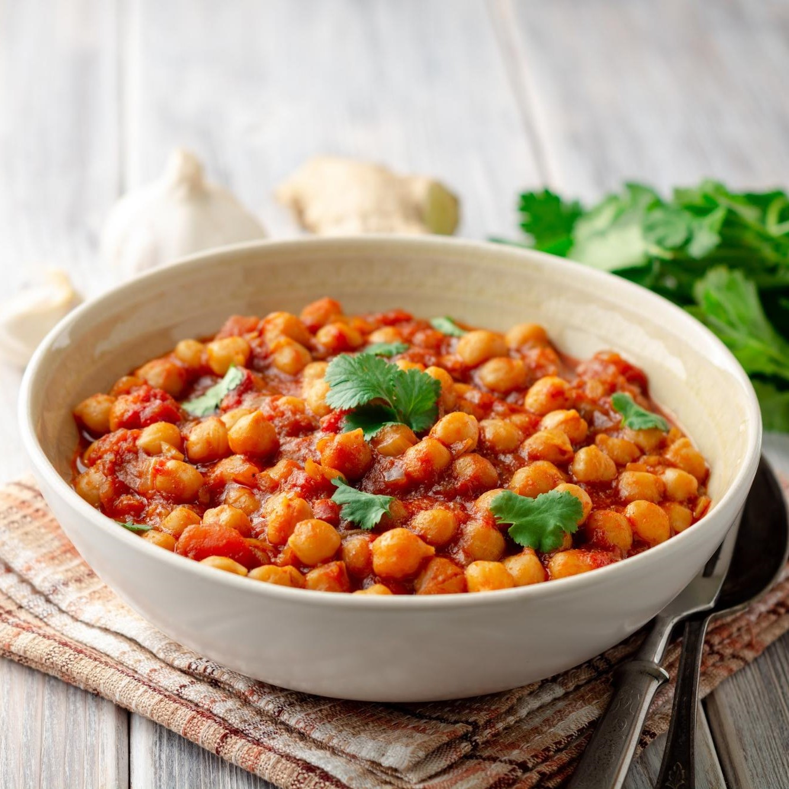

 

 chana masala is an indian chickpeas recipe: to fully benefit from the chickpeas' proteins couple them with some rice! [find the recipe below](#pilaf-rice). 

## ingredients:

- cooked chickpeas (normal or decorticated): 230g
- tomato sauce or purée: 350g
- garlic: 1 big clove
- chana masala: 2 full teaspoons
- ginger: 2cm
- juice of half a lemon
- salt
- sugar: 1 teaspoon
  
> note: **chana masala** (picture below) is a mix of spices you can find in ethnic shops. if you don’t have it, you can mix the following spices - or just the ones you have among these: chili pepper, cumin, coriander, cardamom, cinnamon, black pepper, cloves, tumeric, dry mango powder.

 <figure class="image">
   
  <figcaption>chana masala spice mix as found in most shops</figcaption>
</figure>

## procedure:

1. mince the garlic clove and sauté it in a pot with some extravirgin olive oil and the chili pepper.
   
2. add the tomato sauce or purée, with the salt and the sugar (that will help make the tomato less acidic) and half a glass of water.
   
3. add the chana masala and mix well.
   
4. cook at medium heat for 25 minutes.
5. if you are accompanying your chana masala with some rice, it's time to start the cooking of it!  [find the recipe below](#pilaf-rice) 

   
6. add the cooked chickpeas to the tomato sauce: you can either use canned and rinsed chickpeas, or cook your own chickpeas: [here are our suggestions](2020-11-01-pulses-guide.md).

7. mince the ginger and add it: it's important to add it at the end and not at beginning, for it will be more tasty this way.

8. squeeze half a lemon in the pot and mix well.
9. turn off the heat and serve hot.

# pilaf rice
1. warm some extra-virgin olive oil in a small pot 
2.  add the rice and toast it for 1-2 minutes
3.  add water, salt and pepper and cover till complete absorption. the ratio of rice and water and the cooking time varies according to the type of rice you use: for basmati rice the ratio is 1:1 and the cooking is 10 minutes.
   
   for more info on **pilaf rice** check [here](2020-11-01-pilaf-rice.md)

