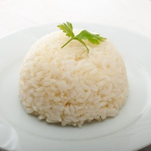

 

this is a quick, healthy and simple way of cooking rice that is widespread in the middle-east.

enjoy it together with vegetables and tofu or pulses for a complete super-nutricious meal.

## procedure
---

1. warm some extra-virgin olive oil in a small pot.
2. add the rice and toast it for a 1/2 minutes.
3. add water, salt and pepper and cover till complete absorption. the ratio of rice and water and the cooking time varies according to the type of rice you use: 
    - for **basmati rice** the ratio is 1:1 and the cooking is 10 minutes. 
    - for **camargue's rice** (typically french): the ratio is 1(rice):1,5(water), so for 180g of rice we used 270g of water; it cooks for 15 min.
4. serve as it is or, in case you want to give it a shape as in the picture, put it into a bowl and press it to make it stick together, then turn it on a plate.

## flavors
---

you can flavour your pilaf rice adding spices and other ingredients to your pot. here are our suggestions:

- **lemon scented rice**: substitute part of the water with some lemon juice and add to the rice the zest of a lemon.
- **yellow rice**: add to the rice some tumeric powder and half a dozen cloves.
