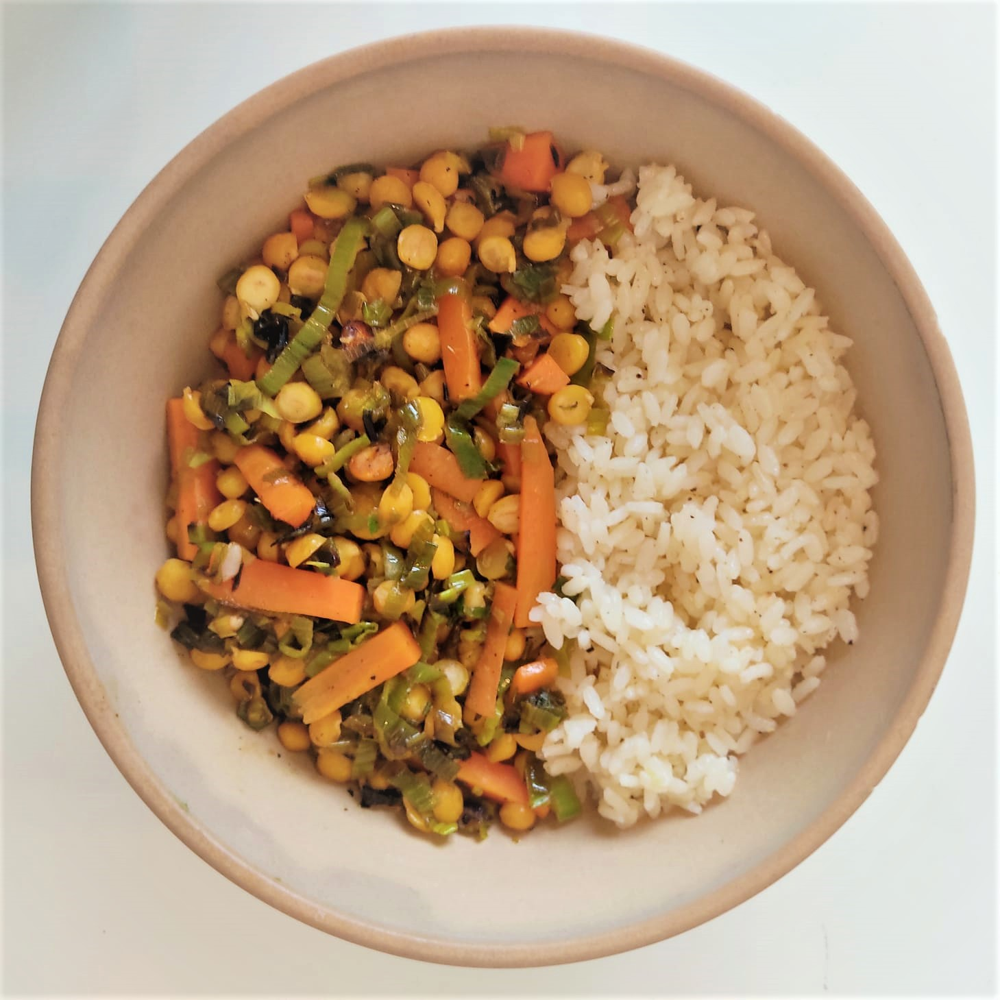

 

## Ingredients:

- Cooked chickpeas: 220g 
- Green part of 3 leeks
- Carrots: 2
- Juice of 1 lemon
- Soy sauce: 1/4 glass
- Agave syrup (or other sweetener, also brown sugar): two tablespoons
- Cornstarch: one teaspoon
- Rice: 180g
- Salt and pepper

## Procedure

1. Cut the green part of three leeks into thin strips: we have chosen to use this part of the leek which is normally thrown away, keeping it aside after using the white part (less leathery) in other recipes. Of course you can use the whole leek, including the white part, in this recipe.

2. Cut the carrots into thin strips. You can use other vegetables of your choice or even mushrooms.

3. In the meanwhile start the pilaf cooking of your rice. Warm some extra-virgin olive oil in a small pot, then put the rice and toast it for a few minutes, then add water, salt and pepper and cover till complete absorption. The ratio of rice and water and the cooking time varies according to the type of rice you use: for basmati rice the ratio is 1:1 and the cooking is 10 minutes. We used Camargue rice: the ratio is 1(rice):1,5(water), so for 180g of rice we used 270g of water; it cooks for 15 min.

4. Put some extra-virgin olive oil into a frying pan, add leeks and carrots (or other vegetables), with a pinch of salt. Cook in parallel to the rice. If it gets too dry add a bit of water.

5. Prepare the sweet and sour sauce: in a glass mix the soy sauce, the lemon juice, the agave syrup/cane sugar, and the cornstarch. 

6. When the vegetables are soft (10 minutes more or less), add the cooked chickpeas. We used decorticated chickpeas that are faster to cook but normal chickpeas will work fine too. You can find suggestions for cooking pulses here, or you can use canned chickpeas, after rinsing.

7. After a couple of minutes, turn off the flame and add the sweet and sour sauce. It’s important to add it with no flame otherwise it will evaporate soon and the dish will be too dry.

8. Serve the chickpeas and vegetables on top of the rice.
