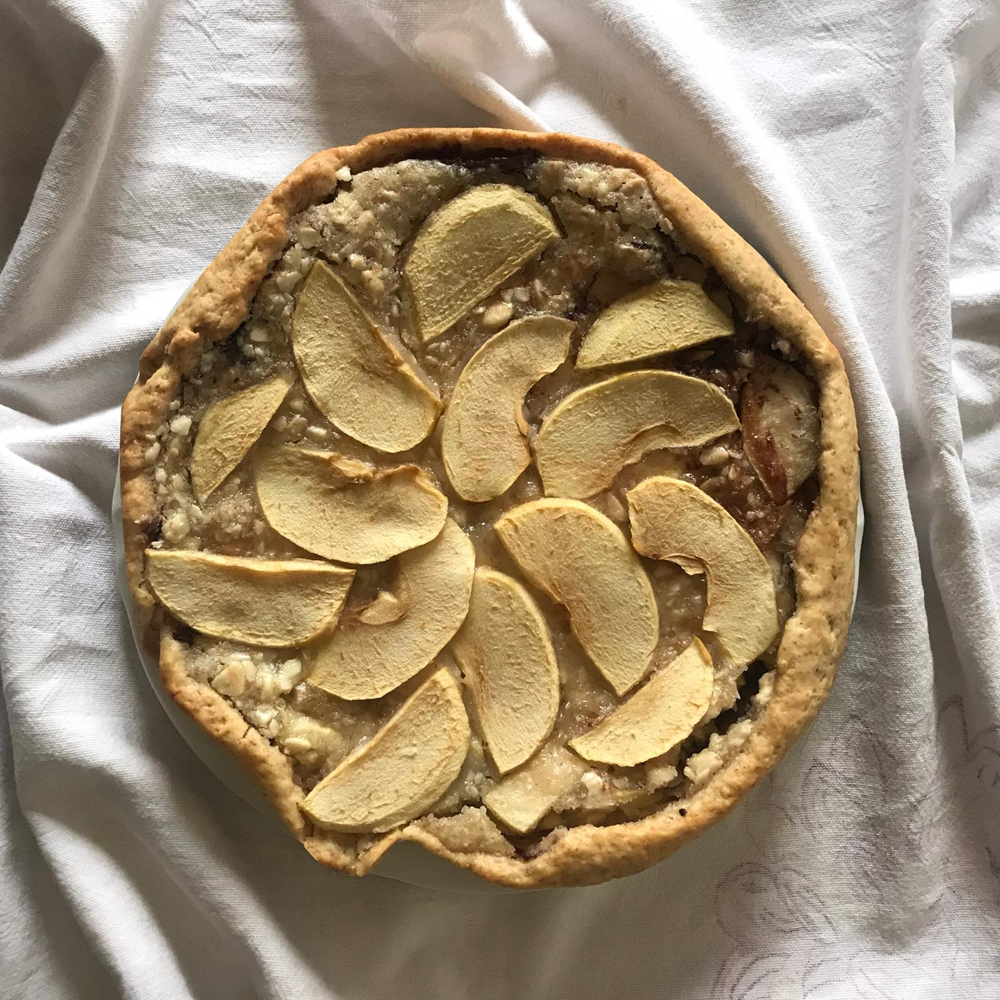

 

this is a plant-based version of the popular french almond cake _tarte amandine_.

start with the shortbrad dough, place it in the cake pan, and then move to the instructions for the filling.

# for the shortbread: 

## ingredients:

- all-purpose flour: 180g
- brown sugar (or other sugar): 20g
- baking powder: 5g
- sunflower oil (or other seed oil): 50g (might need 10g more if you use 00 flour)
- vegetable drink: 50g
- salt: 1 pinch

## procedure:

add the liquid ingredients to the dry ingredients and knead for a few minutes until smooth. it is not necessary to let it rest before rolling out.

# for the filling:

## ingredients:

- sunflower oil: 90g
- brown sugar: 85g 
- cornstarch or potato starch: 2 tablespoons
- soy yogurt: 65g
- chopped almonds: 125g
- all-purpose flour: 30g 
- dark chocolate: 20g
- apple: 1

## procedure:

1. melt the chocolate in the microwave or bain-marie. 
2. chop the almonds half finely, half coarsely. 
3. combine oil, sugar, cornstarch, yogurt, almonds and flour and mix. 
4. add the apple cut in slices to the mix.
5. roll out a melted chocolate couche on the already rolled out shortbread dough. 
6. on top of the chocolate couche, add the prepared mix.
7. bake at 180 degrees in a preheated ventilated oven for 30 minutes.

> we suggest heating it slightly (in the microwave) before eating it.
