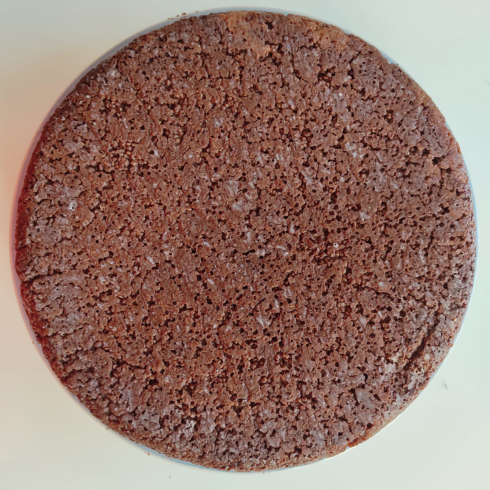

 
 
 <!--more-->

 this is a gluten free chocolate cake that doensn't require the use of flour of any kind. the use of cooked quinoa gives it a special and delicious texture.

## ingredients
---

- quinoa: 300g
- water: 600g
- dark chocolate: 200g
- corn starch: 40g
- brown sugar: 100g
- sunflower oil: 60g
- baking powder: 2 teaspoons
- vegetable drink: 280g
- salt: 1 pinch

## procedure
---

1. rinse the quinoa in abundant water (this way you will remove saponins that would make the quinoa bitter).
2. put the quinoa in 600g of cold water with a pinch of salt and turn on the heat.
3. when the water boils, cover, lower the heat and cook for 15 minutes until complete water absorption.
4. while the quinoa cooks, melt the chocolate in *bain-marie*.
5. mix the dry ingredients in a bowl: the cornstarch, the sugar and the baking powder.
6. stirring, slowly add the vegetable drink and the sunflower oil to the bowl.
7. when the quinoa is ready, add it to the other ingredients.
8. finally add the melted chocolate.
9. pour the mix in a baking pan (22cm diamater).
10. bake for 45 minutes in 180° C pre-heated static oven. when done, it will be soft, but will harden as it cools down.
11. eat it warm.
    
    

