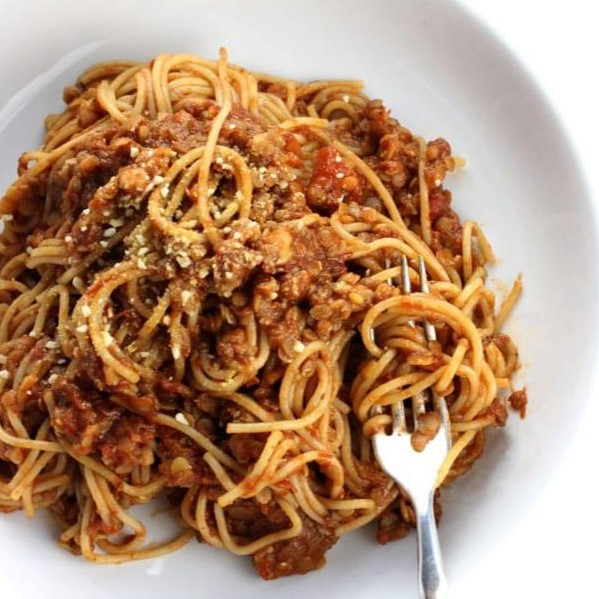

 
 
 <!--more-->

here are two versions of vegan ragù, the tipical italian sauce that we use together with pasta or lasagne.

*quantities for 4 portions: consider making more than you need for one meal and then store in the fridge.*

# lentil ragù

## ingredients
---

- onion: 1/2
- celery: 1/2 head
- carrot: 1/2
- cooked lentils: 400g
- rosemary at will 
- tomato puree: 500g 
- salt

## procedure
---

1. mince the onion, the celery and the carrot and sauté in extra virgin olive oil.
2. pour 200g of cooked lentils: you can used canned lentils or cook you own - [here are our suggestions](https://fagiolini.github.io/pulses-guide/). 
3. optional: add a little bit of rosemary.
4. after a couple of minutes, add the tomato puree and a pinch of salt. cook for another 5-10 minutes stirring occasionally.
5. serve with pasta or use it to make great lasagne!

# tofu ragù

## ingredients
---

- onion: 1
- carrots: 1 and 1/2 
- celery: 1/2 head
- tofu: 300g
- tomato sauce: 400g
- salt
- sugar: 1 teaspoon

## procedure
---

1. mince the onion, the carrots and the celery (use the leafs too, don't throw them away!).
2. sauté them in extra-virgin olive oil with a generous pinch of salt in a pot.
3. crumble the tofu with your hands and add to the pot. sauté for a few more minutes at high heat.
4. add the tomato sauce with half a glass of water and a teaspoon of sugar.
5. cover, lower the heat and cook for 30 minutes, stirring from time to time.
6. serve with pasta or with lasagne and enjoy!
